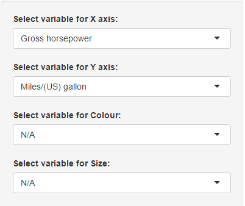

## Motor Trend Car Road Tests Dataset - Analysis

[Motor Trend Car Road Tests Dataset](https://stat.ethz.ch/R-manual/R-devel/library/datasets/html/mtcars.html): The data was extracted from the 1974 Motor Trend US magazine, and comprises fuel consumption and 10 aspects of automobile design and performance for 32 automobiles (1973-74 models).

**Data Analysis**: There are many factors that can affect to mpg (Miles per gallon), and therefore it is required to analyze relationships of many different variables to recognize [confounding variables](https://en.wikipedia.org/wiki/Confounding) and to avoid [omitted-variable bias](https://en.wikipedia.org/wiki/Omitted-variable_bias) when estimating mpg.

---

## Analysis Options

1. Customize x-axis and/or y-axis
2. Customize plotting points by
  - Colour
  - Size



---

## The resulting PLOT

The resulting plot looks like this

```{r echo=FALSE, warning=FALSE}
data(mtcars)
library(ggplot2)
mtcars$gear <- factor(mtcars$gear,levels=c(3,4,5), labels=c("3gears","4gears","5gears"))
mtcars$am <- factor(mtcars$am,levels=c(0,1), labels=c("Automatic","Manual"))
mtcars$cyl <- factor(mtcars$cyl,levels=c(4,6,8), labels=c("4cyl","6cyl","8cyl"))
mtcars$vs <- factor(mtcars$vs,levels=c(0,1), labels=c("V engine","Straight engine"))
qplot(hp, mpg, data=mtcars, colour=cyl, size=wt, method="lm", geom=c("point", "smooth"))
```

---

## Correlation

Correlation of x-axis variable and y-axis variable is calculated and displayed also.


---

## Future Works

<p align="left"><b>In order for user to be able to perform data analysis on many different datasets, this data product could be expanded by</b></p>

<p align="left">1. Allowing user to input either:</p>
<p align="left">  - Name of a dataset that can be loaded directly using _data_ command in r</p>
<p align="left">  - Path to a local csv file that contain any data that user wish to analyze</p>
<p align="left">2. Then data variables shall be loaded automatically into the customized selection boxes of x-axis, y-axis, colour, size</p>
